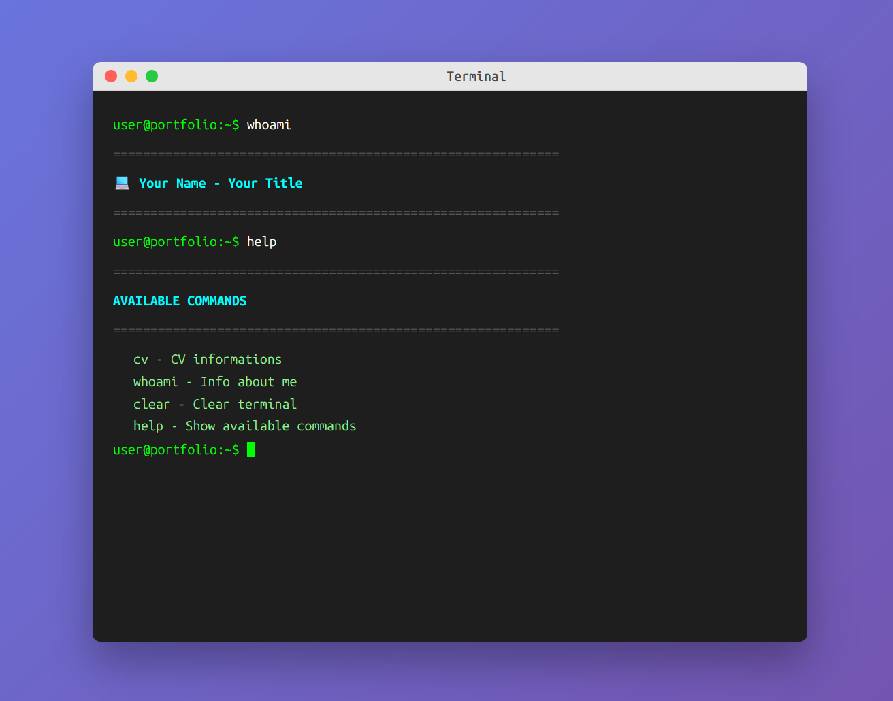

# Terminal Portfolio Template

A modern, interactive terminal-style portfolio website with a sleek design and smooth animations.

## 🌐 Live Demo

Check out the live demo: **[https://vinceboxx.github.io/terminal-portfolio/](https://vinceboxx.github.io/terminal-portfolio/)**

## 📸 Screenshot



*Interactive terminal interface with command-line navigation*

## Features

- **Terminal Interface**: Interactive terminal simulation with command-line interface
- **Responsive Design**: Works on desktop and mobile devices
- **Modern Styling**: Clean macOS-inspired terminal window design
- **Interactive Commands**: Navigate through different sections using terminal commands
- **Smooth Animations**: Elegant transitions and hover effects
- **Dark Theme**: Professional dark color scheme with syntax highlighting
- **Customizable**: Easy to modify colors, fonts, and layout

## Available Commands

- `cv overview` - Display professional summary
- `cv work` - Show work experience
- `cv education` - Display education and certifications
- `cv skills` - List technical skills
- `cv languages` - Show language proficiencies
- `cv contacts` - Display contact information
- `whoami` - Show personal information
- `help` - Display available commands
- `clear` - Clear terminal screen

## Quick Start

1. **Clone the repository**
   ```bash
   git clone https://github.com/yourusername/terminal-portfolio.git
   cd terminal-portfolio
   ```

2. **Customize your information**
   - Edit `data.js` to add your personal information
   - Update work experience, education, skills, and contact details
   - Modify the overview section with your professional summary

3. **Customize styling (optional)**
   - Edit `styles.css` to change colors, fonts, or layout
   - Modify terminal colors and animations as desired

4. **Deploy**
   - Upload files to your web server
   - Or use GitHub Pages, Netlify, or Vercel for free hosting

## File Structure

```
terminal-portfolio/
├── index.html          # Main HTML file
├── data.js             # Your personal data and CV information
├── script.js           # Terminal functionality and logic
├── styles.css          # Styling and animations
├── robots.txt          # SEO robots file
└── README.md           # This file
```

## Customization Guide

### Personal Information
Edit the `cvData` object in `data.js`:

```javascript
const cvData = {
    overview: `Your professional summary here...`,
    work: [...],      // Your work experience
    education: [...], // Your education
    skills: {...},    // Your technical skills
    languages: [...], // Your languages
    contacts: {...}   // Your contact information
};
```

### Terminal Appearance
Modify `styles.css` to change:
- Terminal colors and background
- Font family and size
- Animation timing
- Layout and spacing

### Commands
Add custom commands in `script.js` by modifying the `initializeCommands()` method.

## Browser Support

- Chrome/Edge (latest)
- Firefox (latest)
- Safari (latest)
- Mobile browsers

## Security Features

- Content Security Policy (CSP) headers
- Input sanitization and validation
- XSS protection
- No external dependencies

## License

Feel free to use and modify this code for your personal portfolio!

## Credits

Original template by [Vinceboxx](https://github.com/Vinceboxx)